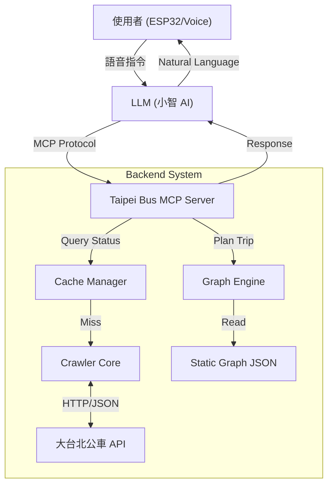

# Taipei Bus AI (台北公車智慧助理)

[](https://www.python.org/)
[](https://modelcontextprotocol.io/)
[](LICENSE)

> **Taipei Bus AI** 是一個基於 Model Context Protocol (MCP) 建構的智慧交通中介系統。
> 專為 ESP32 等語音邊緣裝置設計，整合「大台北公車」即時動態 API 與靜態路網資料，提供低延遲、高準確度的語音公車查詢與導航服務。

---

## 📖 專案簡介 (Introduction)

本專案旨在解決傳統公車查詢 App 操作繁瑣的問題。透過 MCP 協定，將「公車動態爬蟲」與「路網導航引擎」封裝為 AI 可呼叫的工具 (Tools)。

這讓 LLM (如小智 AI、Claude、ChatGPT) 能直接理解複雜的自然語言需求，並回傳精確的答案：
*   ❌ "307號公車在哪？"
*   ✅ **"307號公車還有 5 分鐘到台北車站，目前在板橋公車站發車。"**
*   ✅ **"我要從大安森林公園去深坑，請幫我規劃路線。"**

### 核心模組
1.  **韌性爬蟲 (Resilient Crawler)**: 處理動態 CSRF Token、雙層 JSON 解析與錯誤重試。
2.  **導航引擎 (Navigation Engine)**: 基於 BFS 演算法，支援 **2次轉乘** (2-Transfer) 的路徑規劃。
3.  **快取層 (Cache Layer)**: 實作 TTL 180秒快取，防止 API 過載並提升回應速度。

## 🚀 核心功能 (Features)

- **即時到站查詢**: 支援雙北市 1000+ 條路線，自動判別去返程。
- **智慧導航規劃**: 
    - 支援「直達」、「轉乘 1 次」與「轉乘 2 次」路徑搜尋。
    - **模糊搜尋**: 輸入 "北車" 自動對應到 "台北車站(忠孝)"。
    - **整合動態**: 規劃結果直接附帶建議班次的「預估到站時間」。
- **高效能架構**: 
    - **靜態路網圖**: 預先建置 Graph，導航計算 < 0.01 秒。
    - **記憶體快取**: 降低來源網站 90% 重複請求。

## 🛠️ 系統架構 (Architecture)



## ⚡ 快速開始 (Quick Start)

### 環境需求
- Python 3.9+
- 網路連線 (需存取 `ebus.gov.taipei`)

### 安裝步驟

1.  **複製專案**
    ```bash
    git clone https://github.com/your-repo/TaipeiBusAI.git
    cd TaipeiBusAI
    ```

2.  **安裝依賴**
    ```bash
    pip install -r requirements.txt
    ```

3.  **資料初始化 (重要)**
    本系統需要下載路線資料才能運作：
    
    *Step 1: 下載路線列表*
    ```bash
    python scripts/init_static_data.py
    ```
    
    *Step 2: 建置路網圖 (導航功能必備)*
    **注意**: 此步驟會爬取所有路線站點，需時約 10-20 分鐘。
    ```bash
    python scripts/build_network_graph.py
    ```
    *(若僅需查詢到站時間，可跳過 Step 2，但無法使用 plan_trip)*

### 啟動伺服器

```bash
# Windows
scripts\run_server.bat

# Linux / Mac
python src/mcp_server.py
```

## 🔌 MCP 工具說明

本伺服器提供以下 Tools 供 AI 模型呼叫：

### `get_bus_arrival_time`
查詢公車到站資訊。
- **參數**: `route_name` (e.g. "307"), `stop_name` (e.g. "板橋"), `direction` (optional)
- **回傳**: 文字描述，包含該站牌所有相符方向的班次狀態。

### `plan_trip`
規劃最佳公車路線。
- **參數**: `start` (起點), `end` (終點)
- **功能**: 
    - 自動進行站名模糊比對。
    - 優先尋找直達車，其次轉乘 1 次，最後轉乘 2 次。
    - 自動查詢建議路線的即時到站時間。

## 📂 專案結構

```plaintext
TaipeiBusAI/
├── config/              
├── data/
│   ├── static/          # routes_map.json, bus_graph.json (路網圖)
│   └── logs/            # 運行日誌與 Debug 報表
├── scripts/             
│   ├── init_static_data.py    # 抓取路線列表
│   ├── build_network_graph.py # 建立路網圖 (Graph Builder)
│   ├── debug_route_to_csv.py  # 匯出特定路線資料
│   └── run_server.bat         # 啟動腳本
├── src/                 
│   ├── crawler_core.py  # 爬蟲引擎
│   ├── graph_engine.py  # 導航演算法 (BFS/Fuzzy Search)
│   ├── mcp_server.py    # MCP Server
│   └── cache_manager.py # 快取層
└── requirements.txt     
```

## 🤝 貢獻指南

歡迎提交 PR 改進演算法或支援更多縣市公車。
特別感謝：TDX 運輸資料流通服務與大台北公車網站提供公開資料。

## 📄 授權 (License)

MIT License
